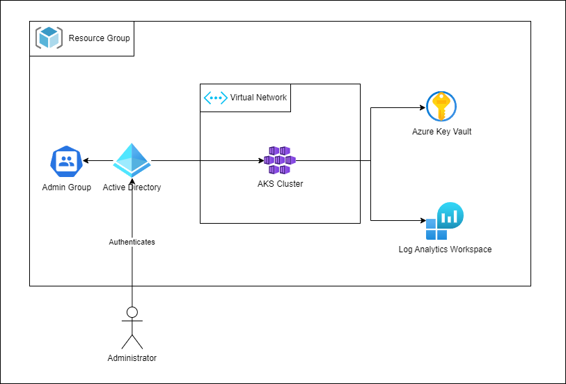

# Azure AKS Cluster Demo Project <!-- omit in toc -->

1. [Developer Instructions](#developer-instructions)
2. [Todos / Ideas for Improvement](#todos--ideas-for-improvement)
3. [Terraform docs](#terraform-docs)
   1. [Requirements](#requirements)
   2. [Providers](#providers)
   3. [Modules](#modules)
   4. [Resources](#resources)
   5. [Inputs](#inputs)
   6. [Outputs](#outputs)

This terraform project will create a simple single node Azure AKS cluster that can be used for experimenting/learning purposes. Since this project is an experimental prototype it should not be used as is in production.

The following features are supported:
- Kubernetes RBAC in combination with Azure AD authentication
- Further security features (disk encryption, IP address restriction, local admin account disabled)
- Log Analytics Workspace
- Azure networking plugin with calico network policies
- Automatically export kube config

The following architecture diagram provides an overview over the resources being created:

The pre-commit tools listed below have been used:
- Checkov
- Terraform fmt
- Terraform docs
- infracost (cost calculation can be adjusted with infracost-usage.yml)

# Developer Instructions
- Configure pre-requisites:
  - Grant terraform service principal permissions to manage RBAC roles (see ManageRoleAssignments)
  - Install CLI tools (Azure CLI, terraform, kubelogin, kubectl)
- Configure values in terraform.tfvars

# Todos / Ideas for Improvement
- Disable public access to AKS cluster and provide alternate way to access the cluster
- Add more AD groups based on a provided list of projects

# Terraform docs

<!-- BEGINNING OF PRE-COMMIT-TERRAFORM DOCS HOOK -->
## Requirements

| Name | Version |
|------|---------|
|  [terraform](#requirement\_terraform) | >= 1.4.4 |
|  [azurerm](#requirement\_azurerm) | ~> 3.50.0 |
|  [local](#requirement\_local) | ~> 2.4.0 |

## Providers

| Name | Version |
|------|---------|
|  [azuread](#provider\_azuread) | 2.36.0 |
|  [azurerm](#provider\_azurerm) | 3.50.0 |

## Modules

| Name | Source | Version |
|------|--------|---------|
|  [admin\_group](#module\_admin\_group) | ./modules/ad-group | n/a |
|  [aks\_cluster](#module\_aks\_cluster) | ./modules/aks-cluster | n/a |
|  [disk\_encryption](#module\_disk\_encryption) | ./modules/disk-encryption | n/a |
|  [networking](#module\_networking) | ./modules/networking | n/a |

## Resources

| Name | Type |
|------|------|
| [azurerm_resource_group.this](https://registry.terraform.io/providers/hashicorp/azurerm/latest/docs/resources/resource_group) | resource |
| [azuread_client_config.current](https://registry.terraform.io/providers/hashicorp/azuread/latest/docs/data-sources/client_config) | data source |

## Inputs

| Name | Description | Type | Default | Required |
|------|-------------|------|---------|:--------:|
|  [admin\_group\_members](#input\_admin\_group\_members) | Object IDs of Azure AD entities that will receive cluster-admin role in kubernetes rbac. | `list(string)` | n/a | yes |
|  [dns\_prefix](#input\_dns\_prefix) | DNS prefix for the AKS cluster | `string` | n/a | yes |
|  [key\_vault\_name](#input\_key\_vault\_name) | Name of the key vault used for disk encryption | `string` | n/a | yes |
|  [kube\_config\_location](#input\_kube\_config\_location) | Will automatically update kube config in the provided location | `string` | n/a | yes |
|  [name](#input\_name) | Naming for the resource created by terraform | `string` | `"aks-demo"` | no |

## Outputs

No outputs.
<!-- END OF PRE-COMMIT-TERRAFORM DOCS HOOK -->